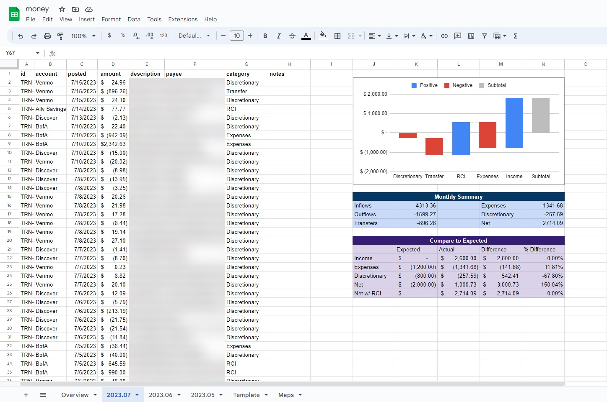

# Bursar

### What is bursar?
Bursar is a tool which automatically pulls spending & transactions via the [SimpleFIN Bridge](https://beta-bridge.simplefin.org/), and updates a linked Google Sheet with the data. Comparable to [Mintable](https://github.com/kevinschaich/mintable/), it can be used to track spending against a budget, or to simply keep a record of transactions.

### What does it look like?


### How can I run it?
Bursar can be run via the provided Docker image, which automatically triggers updates on a set schedule. It can also be run as a simple Python script, which can be triggered manually or on a schedule with a tool like `cron`. Either way, however, some setup is required - namely, the generation of a SimpleFIN setup token and a Google Cloud service account.

##### Setup
First, register with the [SimpleFIN Bridge](https://beta-bridge.simplefin.org/) - this costs $15/year. Once registered, log-in to the SimpleFIN dashboard, connect your bank and other accounts, and generate a setup token. Save this for now.

Next, [create a Google Cloud service account](https://cloud.google.com/iam/docs/service-accounts-create). Download the service account key as a JSON file. A couple notes:
- You must have enabled the Google Drive API and Google Sheets API for your project.
- Step 2 in the "Create service account" screen ("Grant this service account access to project") should be left blank here.
- After creating the service account, enter its dashboard, go to the "Keys" tab, and create a new JSON key. This is what you should have saved.
- The Google Sheet to be updated must be shared with the service account email address, as an editor.

##### Running in Docker
Use the provided `docker-compose.yml` and `.env.template` files. Fill in your `.env` file using the instructions provided there. 

Next, create a directory named `config` adjacent to your `docker-compose.yml`. Save your Google Cloud service account key in this `config` folder as `google_auth.json`, ensuring that permissions on both the `config` folder and `google_auth.json` file are set for the user, and not `root`. Your final directory structure should look like this:
```
.
├── config
│   └── google_auth.json
├── docker-compose.yml
└── .env
```

Finally, run `docker compose up -d` to start the container. Check the success or failure of the setup with `docker logs bursar`.


##### Running as a Python script
Clone the repository, and create a `.env` file with the instructions specified in `.env.template`. Next, create a directory named `config` at the path specified as `CONFIG_PATH` in `.env`. Save your Google Cloud service account key in this `config` folder as `google_auth.json`.

Running `setup.py` will validate your credentials, convert your SimpleFIN bridge setup token into access credentials, and perform an initial pull of data into your Google Sheet. Subsequent updates can be performed by running `update.py`, which can be triggered manually or on a schedule with a tool like `cron`. The `update.py` script takes an argument for the past number of days to pull transactions for, and defaults to 1 day if no argument is provided.


### Why bursar?
For Europeans, more fully-featured self-hosted options like [Firefly III](https://firefly-iii.org/) and [Actual Budget](https://actualbudget.com/) exist, which integrate with Nordigen, etc. to automatically pull transaction data. 

For Americans, bank integration is largely dependent on Plaid or similar services. [Mintable](https://github.com/kevinschaich/mintable/) is a very similar tool, which fetches transaction data from a Plaid developer account and updates a Google Sheet. If this works for you, it's probably the way to go - Mintable is more mature, better maintained, and comparatively well-written. However, Plaid developer accounts don't work with all banks - specifically, they don't work with Bank of America, which requires a Plaid production account. Plaid production accounts require a lengthy application process with KYC steps, so it's largely not feasible to set up as an individual.

For that reason, I wanted to recreate Mintable's functionality using SimpleFIN, which wraps Plaid competitor MX and allows me to pull data from all of my accounts more reliably, hence bursar.

Although bursar is a working solution, hacked together in a few hours, that I'm actively using for now, in the long-term I hope to migrate to a more fully-featured self-hosted solution like Actual Budget. For now, however, integrating Firefly III or Actual Budget with SimpleFIN isn't something which can be done cleanly, so I intend to rely on and maintain bursar until that changes.